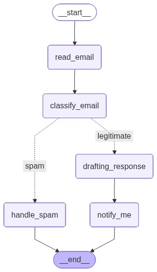

# email_check_langgraph
Email processing system based on LangGraph

## Workflow

1) Read incoming emails
2) Classify them as spam or legitimate
3) Draft a preliminary response for legitimate emails
4) Send email information when legitimate (printing only)

## Installation

# Install the required packages
pip install -q langgraph langchain_openai langchain_huggingface pyppeteer